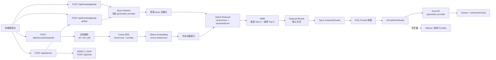

# Local AI Assistant

基于 **Spring Boot 3 + Java 17** 的本地多文档 RAG 知识库问答系统。

项目支持上传 `txt`、`md`、`pdf` 文档，自动完成文档解析、chunk 切分、本地 embedding 生成、内存向量索引、Query Rewrite、Hybrid Retrieval、MMR 去重选择，并将 Top-K `retrievedChunks` 作为上下文交给生成模型回答问题。

当前架构中：

- **Embedding provider**：本地 Ollama `nomic-embed-text`
- **Generation provider**：Kimi API
- **Provider 架构**：通过 `AiChatClient` + `AiChatClientRouter` 支持扩展不同生成模型 provider

> 注意：README 中只展示环境变量名和配置方式，不包含任何 API key。

## 核心功能

- Spring Boot 3 + Java 17 后端服务
- 文档上传接口，支持 `txt`、`md`、`pdf`
- 文档解析与文本提取
- 基于 `chunk-size` 和 `chunk-overlap` 的 chunk 切分
- 调用本地 Ollama `nomic-embed-text` 生成 embedding
- 内存向量索引，保存文档 chunk 与 embedding
- v1.6 Auto RAG Mode：Query Planner 自动判断 Direct Chat 或 Knowledge Search
- v1.4 Advanced RAG Retrieval Pipeline：Query Rewrite -> Hybrid Retrieval -> MMR
- 基于 cosine similarity 的向量检索
- Hybrid Retrieval：`vectorScore + keywordScore -> finalScore`
- MMR 从候选 Top-N 中选择最终 Top-K，减少重复 chunk
- `retrievedChunks` 返回 `score`、`vectorScore`、`keywordScore`、`finalScore`
- 单文档问答：`/api/knowledge/ask`
- 多文档全局问答：`/api/knowledge/ask-global`
- 返回 Top-K `retrievedChunks`
- Kimi API 作为回答生成模型 provider
- 内存版短期会话记忆，通过 `sessionId` 隔离多轮对话
- 支持扩展更多生成模型 provider
- 前端控制台演示上传、索引、问答和检索片段追踪

## 技术栈

| 模块 | 技术 |
| --- | --- |
| Backend | Spring Boot 3.3.5, Java 17 |
| Build | Maven |
| Web | Spring Web, Bean Validation |
| Document Parsing | Apache PDFBox, plain text parser, markdown parser |
| Embedding | Ollama `nomic-embed-text` |
| Vector Index | In-memory chunk embedding index |
| Persistence | MySQL + MyBatis |
| Retrieval | Auto Planner + Query Rewrite + Hybrid Retrieval + MMR |
| Generation Provider | Kimi API |
| Provider Routing | `AiChatClient`, `AiChatClientRouter` |
| Frontend | HTML, CSS, Vanilla JavaScript |

## 系统架构



## RAG 工作流

1. 用户上传文档。
2. 后端根据文件扩展名选择解析器，提取文本。
3. 文本被切分为带 overlap 的 chunks。
4. 每个 chunk 调用本地 Ollama `nomic-embed-text` 生成 embedding。
5. 系统将 chunk、文档信息和 embedding 保存到内存索引。
6. 用户提问时，系统先通过当前 generation provider 做 Query Rewrite，生成更适合检索的短 query；改写失败会回退原问题。
7. 改写后的 query 会生成 embedding。
8. 检索服务计算 query 向量和 chunk 向量的 cosine similarity，得到 `vectorScore`。
9. 系统根据 query 关键词对命中文件名或正文的 chunk 计算 `keywordScore`。
10. Hybrid Retrieval 根据 `vectorScore` 和 `keywordScore` 计算 `finalScore`，并保留旧字段 `score=finalScore`。
11. MMR 从候选 Top-N chunks 中选择最终 Top-K，降低重复片段进入上下文的概率。
12. 可选 Rerank 默认关闭，主流程不依赖额外重排调用。
13. 将 retrieved chunks 拼接进 prompt。
14. 通过 provider router 调用 Kimi API 生成最终回答。
15. API 返回回答和可追踪的 `retrievedChunks`。

## v1.4 Advanced RAG Retrieval Pipeline

v1.4 重点提升检索质量和简历含金量，不引入 Elasticsearch、向量数据库或新的中间件，仍然基于当前内存索引完成高级检索链路。

```text
用户问题
  -> Query Rewrite
  -> Ollama Embedding
  -> Hybrid Retrieval(vectorScore + keywordScore)
  -> MMR(candidate Top-N -> final Top-K)
  -> Optional Rerank(default off)
  -> RAG Prompt
  -> Kimi Generation
  -> reply + retrievedChunks
```

新增能力：

- Query Rewrite：使用当前 generation provider 将用户问题改写成关键词化检索 query；失败自动 fallback 原问题。
- Hybrid Retrieval：同时考虑向量相似度和关键词命中，返回 `vectorScore`、`keywordScore`、`finalScore`。
- MMR：从候选 Top-N 中选择最终 Top-K，降低相似 chunk 重复，提高上下文多样性。
- Optional Rerank：预留轻量 rerank 开关，默认关闭，保证主链路稳定。
- 日志安全：只记录 `questionLength`、`retrievalQueryLength`、`promptLength` 等长度信息，不打印完整用户问题或完整 prompt。

## v1.6 Auto RAG Mode

v1.6 增加轻量级 Query Planner，不引入 Agent 框架、工具调用、搜索引擎或新中间件。Auto 模式由前端编排：先调用 `POST /api/planner` 判断用户意图，再自动选择现有聊天接口或全局 RAG 接口。

```text
User Question
  -> Query Planner
  -> DIRECT_CHAT or KNOWLEDGE_SEARCH
  -> /api/chat or /api/knowledge/ask-global
  -> Answer
```

Planner 返回：

```json
{
  "intent": "DIRECT_CHAT"
}
```

或：

```json
{
  "intent": "KNOWLEDGE_SEARCH"
}
```

判定策略：

- 明显寒暄优先判定 `DIRECT_CHAT`。
- 包含“文档 / 上传 / PDF / 资料 / 知识库 / 根据 / 附件 / 来源”等知识库信号时判定 `KNOWLEDGE_SEARCH`。
- 规则无法判断且 `rag.planner.enabled=true` 时，使用当前 generation provider 做轻量分类。
- Planner 调用失败或输出非法时，回退到 `rag.planner.fallback-intent`，默认 `KNOWLEDGE_SEARCH`。
- `rag.auto.enabled=false` 时 Auto 退化为 Global RAG。

## Provider 架构

生成模型通过统一接口抽象：

```text
AiChatClient
├── KimiAiChatClient
└── OllamaAiChatClient
```

`AiChatClientRouter` 根据配置项 `ai.provider` 选择实际 provider：

```yaml
ai:
  provider: kimi
```

当前支持：

- `kimi`：使用 Kimi API 生成回答
- `ollama`：使用本地 Ollama 生成回答

扩展新的 provider 时，只需要：

1. 实现 `AiChatClient`
2. 添加 provider 配置类
3. 在 `AiChatClientRouter` 中注册路由分支

## 配置

主要配置位于 `src/main/resources/application.yml`。

```yaml
server:
  port: 8080

ai:
  provider: kimi

ollama:
  base-url: http://localhost:11434
  embedding-model: nomic-embed-text
  connect-timeout: 3s
  read-timeout: 60s

kimi:
  base-url: https://api.moonshot.cn/v1
  api-key: ${MOONSHOT_API_KEY:}
  model: kimi-k2.6

app:
  upload-dir: data/uploads
  max-context-length: 8000
  chunk-size: 400
  chunk-overlap: 80
  retrieval-top-k: 3
  memory:
    enabled: true
    max-turns: 6

rag:
  auto:
    enabled: true
  planner:
    enabled: true
    fallback-intent: KNOWLEDGE_SEARCH
  rewrite:
    enabled: true
    max-length: 160
  hybrid:
    enabled: true
    vector-weight: 1.0
    keyword-weight: 0.35
  mmr:
    enabled: true
    lambda: 0.75
    candidate-size: 12
  rerank:
    enabled: false
```

### v1.4 RAG 配置说明

| 配置项 | 默认值 | 说明 |
| --- | --- | --- |
| `rag.auto.enabled` | `true` | 是否启用 Auto RAG Mode；关闭时 Auto 退化为 Global RAG |
| `rag.planner.enabled` | `true` | 是否启用 LLM Planner；关闭时只使用规则判断 |
| `rag.planner.fallback-intent` | `KNOWLEDGE_SEARCH` | Planner 失败或无法判断时的回退意图 |
| `rag.rewrite.enabled` | `true` | 是否启用 Query Rewrite |
| `rag.rewrite.max-length` | `160` | 改写 query 最大长度 |
| `rag.hybrid.enabled` | `true` | 是否启用 Hybrid Retrieval |
| `rag.hybrid.vector-weight` | `1.0` | 向量分权重 |
| `rag.hybrid.keyword-weight` | `0.35` | 关键词分权重 |
| `rag.mmr.enabled` | `true` | 是否启用 MMR |
| `rag.mmr.lambda` | `0.75` | 相关性和多样性的平衡系数，越高越偏相关性 |
| `rag.mmr.candidate-size` | `12` | MMR 候选集大小 |
| `rag.rerank.enabled` | `false` | 轻量 rerank 预留开关，默认关闭 |

### 配置 MOONSHOT_API_KEY

推荐使用环境变量，不要把 API key 写入代码或提交到 Git。

macOS / Linux:

```bash
export MOONSHOT_API_KEY="your_api_key_here"
```

Windows PowerShell:

```powershell
$env:MOONSHOT_API_KEY="your_api_key_here"
```

项目也支持在本地 `.env` 文件中配置，适合开发环境：

```bash
MOONSHOT_API_KEY=your_api_key_here
```

请确保 `.env` 不被提交到仓库。

## 启动本地 Ollama

安装 Ollama 后，启动服务：

```bash
ollama serve
```

拉取 embedding 模型：

```bash
ollama pull nomic-embed-text
```

验证 embedding 接口：

```bash
curl -X POST "http://localhost:11434/api/embeddings" \
  -H "Content-Type: application/json" \
  -d '{
    "model": "nomic-embed-text",
    "prompt": "hello local rag"
  }'
```

如果你希望把生成模型也切回本地 Ollama，可以将：

```yaml
ai:
  provider: ollama
```

此时需要额外拉取本地生成模型，并在 `ollama.model` 中配置对应模型名称。

## 运行项目

安装依赖并启动 Spring Boot：

```bash
mvn spring-boot:run
```

服务地址：

```text
http://localhost:8080
```

前端控制台：

```text
http://localhost:8080/index.html
```

运行测试：

```bash
mvn test
```

构建项目：

```bash
mvn clean package
```

## API 测试

所有接口返回统一结构：

```json
{
  "code": 0,
  "msg": "success",
  "data": {}
}
```

### 1. 上传文档

```bash
curl -X POST "http://localhost:8080/api/documents/upload" \
  -F "file=@./test/test.txt"
```

响应示例：

```json
{
  "code": 0,
  "msg": "success",
  "data": {
    "documentId": "b7b4f5d2-6a2d-4b12-9f4c-6c9a44f2d111",
    "fileName": "test.txt",
    "contentLength": 2048,
    "uploadTime": "2026-05-14T10:30:00"
  }
}
```

### 2. 查看文档列表

```bash
curl "http://localhost:8080/api/documents"
```

### 3. 单文档问答

```bash
curl -X POST "http://localhost:8080/api/knowledge/ask" \
  -H "Content-Type: application/json" \
  -d '{
    "documentId": "b7b4f5d2-6a2d-4b12-9f4c-6c9a44f2d111",
    "question": "这份文档主要讲了什么？"
  }'
```

响应示例：

```json
{
  "code": 0,
  "msg": "success",
  "data": {
    "documentId": "b7b4f5d2-6a2d-4b12-9f4c-6c9a44f2d111",
    "fileName": "test.txt",
    "model": "kimi-k2.6",
    "reply": "这份文档主要介绍了 ...",
    "retrievedChunks": [
      {
        "chunkId": "7d09c3b6-9e2e-40f8-8f2b-2a52c27e0a61",
        "documentId": "b7b4f5d2-6a2d-4b12-9f4c-6c9a44f2d111",
        "fileName": "test.txt",
        "chunkIndex": 2,
        "score": 0.8421,
        "vectorScore": 0.7812,
        "keywordScore": 0.1740,
        "finalScore": 0.8421,
        "contentPreview": "这里是被检索命中的文档片段预览..."
      }
    ]
  }
}
```

### 4. 多文档全局问答

```bash
curl -X POST "http://localhost:8080/api/knowledge/ask-global" \
  -H "Content-Type: application/json" \
  -d '{
    "question": "对比这些文档中关于 Spring Boot 和 RAG 的内容。"
  }'
```

全局问答会跨所有已索引文档检索，返回综合分数最高的 Top-K `retrievedChunks`。

## 会话记忆（Conversation Memory）

当前版本提供内存版短期会话记忆，用于支持 `/api/chat` 和 `/api/knowledge/ask-global` 的多轮上下文理解。

- 请求通过 `sessionId` 隔离不同会话；未传时默认使用 `default`。
- 最近 N 轮历史会拼入生成 prompt，N 由 `app.memory.max-turns` 控制。
- 一轮对话包含一条 user 消息和一条 assistant 消息。
- RAG 检索阶段仍只使用当前问题做 embedding，避免历史污染检索结果。
- RAG 生成阶段会结合最近历史对话和当前检索到的 `retrievedChunks`。
- 会话历史会写入 MySQL `chat_history`；应用重启后可从数据库恢复最近 N 轮历史。
- RAG 文档元数据和 chunks 会写入 MySQL；应用启动时会从 `document_chunks.embedding_json` 重建内存向量索引。
- 当前仍使用内存向量索引执行检索，没有引入向量数据库。
- 如果 MySQL 未启动或未初始化表结构，应用启动或接口调用会报错；请先创建数据库并执行 `sql/init.sql`。
- 未来可升级为向量数据库或在 MySQL 中增加更完整的索引重建/迁移机制。

## MySQL 持久化

v1.2 使用 MySQL + MyBatis 保存文档、chunks 和会话历史。数据库密码通过环境变量传入，不要写入配置文件或提交到 Git。

创建数据库：

```sql
CREATE DATABASE local_ai_assistant DEFAULT CHARACTER SET utf8mb4 COLLATE utf8mb4_unicode_ci;
```

初始化表：

```bash
mysql -uroot -p local_ai_assistant < sql/init.sql
```

主要配置：

```yaml
spring:
  datasource:
    url: jdbc:mysql://localhost:3306/local_ai_assistant?useSSL=false&serverTimezone=Asia/Shanghai&allowPublicKeyRetrieval=true
    username: root
    password: ${MYSQL_PASSWORD:}
    driver-class-name: com.mysql.cj.jdbc.Driver

mybatis:
  mapper-locations: classpath:mappers/*.xml
  configuration:
    map-underscore-to-camel-case: true
```

启动时会自动读取 `documents` 和 `document_chunks`，解析 `embedding_json` 并重建内存向量索引。日志示例：

```text
[VectorIndexBootstrap] loadedDocuments=1, loadedChunks=3
```

如果数据库为空，会正常启动并输出：

```text
[VectorIndexBootstrap] no persisted chunks found, loadedDocuments=0, loadedChunks=0
```

### 普通聊天连续对话

```bash
curl -X POST "http://localhost:8080/api/chat" \
  -H "Content-Type: application/json" \
  -d '{
    "sessionId": "test-session",
    "message": "我正在做一个 local-ai-assistant 项目，它是一个 RAG 知识库问答系统。"
  }'

curl -X POST "http://localhost:8080/api/chat" \
  -H "Content-Type: application/json" \
  -d '{
    "sessionId": "test-session",
    "message": "它适合写进简历的哪一部分？"
  }'
```

### RAG 连续问答

```bash
curl -X POST "http://localhost:8080/api/knowledge/ask-global" \
  -H "Content-Type: application/json" \
  -d '{
    "sessionId": "rag-session",
    "question": "这个项目使用了什么技术？"
  }'

curl -X POST "http://localhost:8080/api/knowledge/ask-global" \
  -H "Content-Type: application/json" \
  -d '{
    "sessionId": "rag-session",
    "question": "为什么要这样设计？"
  }'
```

### 查看记忆

```bash
curl "http://localhost:8080/api/chat/memory/rag-session"
```

响应会包含 `sessionId`、`memoryEnabled`、`messageCount`、`historyTurns` 和 `messages`。

### 清空记忆

```bash
curl -X DELETE "http://localhost:8080/api/chat/memory/test-session"
```

响应示例：

```json
{
  "code": 0,
  "msg": "success",
  "data": {
    "sessionId": "test-session",
    "cleared": true
  }
}
```

## 前端控制台

前端位于：

```text
src/main/resources/static
```

启动后访问：

```text
http://localhost:8080/index.html
```

控制台能力：

- 上传并索引文档
- 查看文档列表、chunk 数量、文档详情和 chunk 摘要
- 删除文档，并同步删除 MySQL 记录和内存向量索引
- 查看 generation provider / embedding provider / embedding model
- 运行时切换 generation provider：`kimi` / `ollama`
- 管理 `sessionId`、清空会话记忆、查看历史 session
- 切换 Auto、Chat、Single Doc、Global RAG
- Auto 模式自动显示 Planner 判定，并根据 intent 调用普通聊天或全局 RAG
- 通过气泡式消息查看用户问题和 AI 回答
- 查看 RAG `retrievedChunks`、`score`、`vectorScore`、`keywordScore`、`finalScore` 和内容预览

## v1.5 Chat-first Workspace

v1.5 将前端从偏 RAG 调试后台升级为 **Chat-first Workspace**。聊天区域成为主视觉中心，用户可以像使用一个知识库助手一样直接提问，而不是先理解接口和检索细节。

主要变化：

- 聊天区域成为页面主视觉中心，文档、会话、Provider 等能力围绕聊天工作流组织。
- `retrievedChunks` 默认折叠，不再占据主要阅读空间。
- AI 回答下方以简洁的 Sources 展示检索来源，保留可追踪性。
- 支持统一的 Auto / Chat / Single Doc / Global RAG 聊天体验。
- 提升项目截图、演示、README 展示和面试讲解时的产品化程度。

## v1.4 Advanced Retrieval 增强

v1.4 在 v1.3 的产品化控制台基础上增强 RAG 检索链路：

- 检索前 query 改写，提高口语化问题对技术关键词和文档片段的召回能力。
- Hybrid score 拆分为 `vectorScore`、`keywordScore`、`finalScore`，让 `retrievedChunks` 更可解释。
- MMR 在候选 Top-N 内做多样性选择，避免多个高度相似 chunk 挤占上下文窗口。
- 所有增强都可通过 `rag.*.enabled` 配置关闭，便于对比原始向量检索效果。

## v1.3 产品化增强

v1.3 聚焦演示体验和工程化完整性，不做用户系统，不做登录注册。这个项目的重点是 RAG pipeline、provider 架构、本地 embedding、检索可解释性和 AI 工程化，而不是后台管理系统。

新增能力：

- 文档详情查看：展示 `contentPreview`、chunk 摘要和 `embeddingDimension`，不返回完整 embedding JSON。
- 文档删除：删除 `documents`、`document_chunks`、内存向量索引，并尽量删除 `data/uploads` 中的源文件。
- Provider 状态查看：展示当前 generation provider、embedding provider 和 embedding model。
- Provider 运行时切换：只影响最终回答生成，embedding 始终由本地 Ollama `nomic-embed-text` 负责。
- 会话管理：查看/清空指定 `sessionId` 的记忆，并列出数据库中出现过的 session。
- 前端产品化控制台：顶部状态栏、provider 切换、文档详情/删除、会话列表、聊天气泡、toast、loading 和 retrievedChunks 展示。

### v1.3 接口

#### Provider 状态

```http
GET /api/settings/provider
```

响应字段：

- `currentProvider`
- `availableProviders`
- `generationProvider`
- `embeddingProvider`
- `embeddingModel`

#### Provider 切换

```http
POST /api/settings/provider
Content-Type: application/json

{
  "provider": "kimi"
}
```

仅允许 `kimi` / `ollama`。非法 provider 会返回清晰业务错误。

#### 文档详情

```http
GET /api/documents/{documentId}
```

返回：

- `documentId`
- `fileName`
- `fileType`
- `contentPreview`
- `chunkCount`
- `createdAt`
- `updatedAt`
- `chunks[]`：`chunkId`、`chunkIndex`、`contentPreview`、`embeddingDimension`

#### 删除文档

```http
DELETE /api/documents/{documentId}
```

删除文档会同步删除数据库记录和内存索引。源文件不存在时不会导致接口失败。

#### 会话列表

```http
GET /api/chat/sessions
```

返回：

- `sessionId`
- `messageCount`
- `lastMessageAt`

### v1.3 推荐配置

```yaml
ai:
  provider: kimi

ollama:
  base-url: http://localhost:11434
  embedding-model: nomic-embed-text
  connect-timeout: 3s
  read-timeout: 60s

kimi:
  base-url: https://api.moonshot.cn/v1
  api-key: ${MOONSHOT_API_KEY:}
  model: kimi-k2.6
```

启动示例：

```bash
mvn spring-boot:run \
  -Dspring-boot.run.arguments="--ai.provider=kimi --ollama.base-url=http://localhost:11434"
```

## 项目结构

```text
src/main/java/com/example/localai
├── client          # Ollama、Kimi、provider router
├── config          # 应用配置、Ollama 配置、Kimi 配置
├── controller      # REST API
├── dto             # 请求与响应 DTO
├── exception       # 业务异常与全局异常处理
├── model           # DocumentRecord、DocumentChunk
└── service         # 文档解析、切块、embedding、检索、问答

src/main/resources
├── application.yml
└── static          # 前端控制台
```

## 当前限制

- 文档元数据、chunk、embedding JSON 和会话历史当前保存在 MySQL。
- 应用启动时会从 MySQL 重建内存向量索引；检索阶段仍使用内存索引。
- 上传文件保存到 `data/uploads`，数据库中会记录文件路径和原始文本。
- 当前内存向量索引适合本地演示和小规模知识库，不适合大规模生产检索。
- 生产环境建议增加鉴权、持久化存储和向量数据库。

## 后续规划

- 持久化文档元数据和 chunk embedding
- 接入 pgvector、Milvus、Qdrant 或 Elasticsearch vector search
- 应用启动时自动重建索引
- 增加文档删除、批量上传和重新索引接口
- 支持流式回答
- 为全局检索增加 metadata filter
- 优化 chunking 策略，支持段落级或语义级切分
- 增加 RAG 评测脚本，评估召回质量和回答忠实度
- 增加更多 generation provider，例如 OpenAI-compatible API、本地 Ollama、多模型 fallback

## 项目亮点

- 使用 Spring Boot 3 + Java 17 实现完整 RAG 后端链路。
- embedding 走本地 Ollama，知识库索引可本地运行。
- 生成模型通过 Kimi API provider 接入，兼顾回答质量和架构扩展性。
- provider router 抽象清晰，后续可平滑扩展更多模型服务。
- 实现轻量级 Agentic RAG Workflow，支持 Query Planning 与自动检索决策，根据用户意图动态选择 Direct Chat 或 Advanced RAG Pipeline。
- 实现 Query Rewrite、Hybrid Retrieval、MMR 的 Advanced RAG Pipeline，可作为简历中的 AI 检索工程亮点。
- 检索结果通过 Top-K `retrievedChunks` 返回，包含 `vectorScore`、`keywordScore`、`finalScore`，回答依据可追踪。
- 前端控制台可直接演示上传、索引、检索、问答完整流程。
