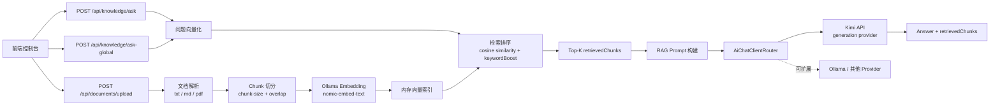

# Local AI Assistant

基于 **Spring Boot 3 + Java 17** 的本地多文档 RAG 知识库问答系统。

项目支持上传 `txt`、`md`、`pdf` 文档，自动完成文档解析、chunk 切分、本地 embedding 生成、内存向量索引、余弦相似度检索，并将 Top-K `retrievedChunks` 作为上下文交给生成模型回答问题。

当前架构中：

- **Embedding provider**：本地 Ollama `nomic-embed-text`
- **Generation provider**：Kimi API
- **Provider 架构**：通过 `AiChatClient` + `AiChatClientRouter` 支持扩展不同生成模型 provider

> 注意：README 中只展示环境变量名和配置方式，不包含任何 API key。

## 核心功能

- Spring Boot 3 + Java 17 后端服务
- 文档上传接口，支持 `txt`、`md`、`pdf`
- 文档解析与文本提取
- 基于 `chunk-size` 和 `chunk-overlap` 的 chunk 切分
- 调用本地 Ollama `nomic-embed-text` 生成 embedding
- 内存向量索引，保存文档 chunk 与 embedding
- 基于 cosine similarity 的向量检索
- 关键词增强检索排序：`cosine similarity + keywordBoost`
- 单文档问答：`/api/knowledge/ask`
- 多文档全局问答：`/api/knowledge/ask-global`
- 返回 Top-K `retrievedChunks`
- Kimi API 作为回答生成模型 provider
- 内存版短期会话记忆，通过 `sessionId` 隔离多轮对话
- 支持扩展更多生成模型 provider
- 前端控制台演示上传、索引、问答和检索片段追踪

## 技术栈

| 模块 | 技术 |
| --- | --- |
| Backend | Spring Boot 3.3.5, Java 17 |
| Build | Maven |
| Web | Spring Web, Bean Validation |
| Document Parsing | Apache PDFBox, plain text parser, markdown parser |
| Embedding | Ollama `nomic-embed-text` |
| Vector Index | In-memory chunk embedding index |
| Retrieval | Cosine similarity + keyword boost |
| Generation Provider | Kimi API |
| Provider Routing | `AiChatClient`, `AiChatClientRouter` |
| Frontend | HTML, CSS, Vanilla JavaScript |

## 系统架构



## RAG 工作流

1. 用户上传文档。
2. 后端根据文件扩展名选择解析器，提取文本。
3. 文本被切分为带 overlap 的 chunks。
4. 每个 chunk 调用本地 Ollama `nomic-embed-text` 生成 embedding。
5. 系统将 chunk、文档信息和 embedding 保存到内存索引。
6. 用户提问时，问题同样会生成 embedding。
7. 检索服务计算问题向量和 chunk 向量的 cosine similarity。
8. 系统根据问题关键词对命中文件名或正文的 chunk 增加 `keywordBoost`。
9. 取 Top-K chunks 作为 `retrievedChunks`。
10. 将 retrieved chunks 拼接进 prompt。
11. 通过 provider router 调用 Kimi API 生成最终回答。
12. API 返回回答和可追踪的 `retrievedChunks`。

## Provider 架构

生成模型通过统一接口抽象：

```text
AiChatClient
├── KimiAiChatClient
└── OllamaAiChatClient
```

`AiChatClientRouter` 根据配置项 `ai.provider` 选择实际 provider：

```yaml
ai:
  provider: kimi
```

当前支持：

- `kimi`：使用 Kimi API 生成回答
- `ollama`：使用本地 Ollama 生成回答

扩展新的 provider 时，只需要：

1. 实现 `AiChatClient`
2. 添加 provider 配置类
3. 在 `AiChatClientRouter` 中注册路由分支

## 配置

主要配置位于 `src/main/resources/application.yml`。

```yaml
server:
  port: 8080

ai:
  provider: kimi

ollama:
  base-url: http://localhost:11434
  embedding-model: nomic-embed-text
  connect-timeout: 3s
  read-timeout: 300s

kimi:
  base-url: https://api.moonshot.cn/v1
  api-key: ${MOONSHOT_API_KEY:${KIMI_API_KEY:}}
  model: kimi-k2.6

app:
  upload-dir: data/uploads
  max-context-length: 8000
  chunk-size: 400
  chunk-overlap: 80
  retrieval-top-k: 3
  memory:
    enabled: true
    max-turns: 6
```

### 配置 MOONSHOT_API_KEY

推荐使用环境变量，不要把 API key 写入代码或提交到 Git。

macOS / Linux:

```bash
export MOONSHOT_API_KEY="your_api_key_here"
```

Windows PowerShell:

```powershell
$env:MOONSHOT_API_KEY="your_api_key_here"
```

项目也支持在本地 `.env` 文件中配置，适合开发环境：

```bash
MOONSHOT_API_KEY=your_api_key_here
```

请确保 `.env` 不被提交到仓库。

## 启动本地 Ollama

安装 Ollama 后，启动服务：

```bash
ollama serve
```

拉取 embedding 模型：

```bash
ollama pull nomic-embed-text
```

验证 embedding 接口：

```bash
curl -X POST "http://localhost:11434/api/embeddings" \
  -H "Content-Type: application/json" \
  -d '{
    "model": "nomic-embed-text",
    "prompt": "hello local rag"
  }'
```

如果你希望把生成模型也切回本地 Ollama，可以将：

```yaml
ai:
  provider: ollama
```

此时需要额外拉取本地生成模型，并在 `ollama.model` 中配置对应模型名称。

## 运行项目

安装依赖并启动 Spring Boot：

```bash
mvn spring-boot:run
```

服务地址：

```text
http://localhost:8080
```

前端控制台：

```text
http://localhost:8080/index.html
```

运行测试：

```bash
mvn test
```

构建项目：

```bash
mvn clean package
```

## API 测试

所有接口返回统一结构：

```json
{
  "code": 0,
  "msg": "success",
  "data": {}
}
```

### 1. 上传文档

```bash
curl -X POST "http://localhost:8080/api/documents/upload" \
  -F "file=@./test/test.txt"
```

响应示例：

```json
{
  "code": 0,
  "msg": "success",
  "data": {
    "documentId": "b7b4f5d2-6a2d-4b12-9f4c-6c9a44f2d111",
    "fileName": "test.txt",
    "contentLength": 2048,
    "uploadTime": "2026-05-14T10:30:00"
  }
}
```

### 2. 查看文档列表

```bash
curl "http://localhost:8080/api/documents"
```

### 3. 单文档问答

```bash
curl -X POST "http://localhost:8080/api/knowledge/ask" \
  -H "Content-Type: application/json" \
  -d '{
    "documentId": "b7b4f5d2-6a2d-4b12-9f4c-6c9a44f2d111",
    "question": "这份文档主要讲了什么？"
  }'
```

响应示例：

```json
{
  "code": 0,
  "msg": "success",
  "data": {
    "documentId": "b7b4f5d2-6a2d-4b12-9f4c-6c9a44f2d111",
    "fileName": "test.txt",
    "model": "kimi-k2.6",
    "reply": "这份文档主要介绍了 ...",
    "retrievedChunks": [
      {
        "chunkId": "7d09c3b6-9e2e-40f8-8f2b-2a52c27e0a61",
        "documentId": "b7b4f5d2-6a2d-4b12-9f4c-6c9a44f2d111",
        "fileName": "test.txt",
        "chunkIndex": 2,
        "score": 0.8421,
        "contentPreview": "这里是被检索命中的文档片段预览..."
      }
    ]
  }
}
```

### 4. 多文档全局问答

```bash
curl -X POST "http://localhost:8080/api/knowledge/ask-global" \
  -H "Content-Type: application/json" \
  -d '{
    "question": "对比这些文档中关于 Spring Boot 和 RAG 的内容。"
  }'
```

全局问答会跨所有已索引文档检索，返回综合分数最高的 Top-K `retrievedChunks`。

## 会话记忆（Conversation Memory）

当前版本提供内存版短期会话记忆，用于支持 `/api/chat` 和 `/api/knowledge/ask-global` 的多轮上下文理解。

- 请求通过 `sessionId` 隔离不同会话；未传时默认使用 `default`。
- 最近 N 轮历史会拼入生成 prompt，N 由 `app.memory.max-turns` 控制。
- 一轮对话包含一条 user 消息和一条 assistant 消息。
- RAG 检索阶段仍只使用当前问题做 embedding，避免历史污染检索结果。
- RAG 生成阶段会结合最近历史对话和当前检索到的 `retrievedChunks`。
- 应用重启后，会话记忆和内存向量索引都会丢失。
- 当前上传文件会保存到 `data/uploads`，但服务重启后不会自动重建内存索引，需要重新上传文档。
- 未来可升级为 MySQL 持久化 `chat_history`，并通过数据库持久化和启动重建索引优化重启后的可用性。

### 普通聊天连续对话

```bash
curl -X POST "http://localhost:8080/api/chat" \
  -H "Content-Type: application/json" \
  -d '{
    "sessionId": "test-session",
    "message": "我正在做一个 local-ai-assistant 项目，它是一个 RAG 知识库问答系统。"
  }'

curl -X POST "http://localhost:8080/api/chat" \
  -H "Content-Type: application/json" \
  -d '{
    "sessionId": "test-session",
    "message": "它适合写进简历的哪一部分？"
  }'
```

### RAG 连续问答

```bash
curl -X POST "http://localhost:8080/api/knowledge/ask-global" \
  -H "Content-Type: application/json" \
  -d '{
    "sessionId": "rag-session",
    "question": "这个项目使用了什么技术？"
  }'

curl -X POST "http://localhost:8080/api/knowledge/ask-global" \
  -H "Content-Type: application/json" \
  -d '{
    "sessionId": "rag-session",
    "question": "为什么要这样设计？"
  }'
```

### 查看记忆

```bash
curl "http://localhost:8080/api/chat/memory/rag-session"
```

响应会包含 `sessionId`、`memoryEnabled`、`messageCount`、`historyTurns` 和 `messages`。

### 清空记忆

```bash
curl -X DELETE "http://localhost:8080/api/chat/memory/test-session"
```

响应示例：

```json
{
  "code": 0,
  "msg": "success",
  "data": {
    "sessionId": "test-session",
    "cleared": true
  }
}
```

## 前端控制台

前端位于：

```text
src/main/resources/static
```

启动后访问：

```text
http://localhost:8080/index.html
```

控制台能力：

- 上传并索引文档
- 查看文档列表
- 切换单文档问答和全局问答
- 输入问题并查看模型回答
- 查看 `retrievedChunks`、相似度分数和内容预览

## 项目结构

```text
src/main/java/com/example/localai
├── client          # Ollama、Kimi、provider router
├── config          # 应用配置、Ollama 配置、Kimi 配置
├── controller      # REST API
├── dto             # 请求与响应 DTO
├── exception       # 业务异常与全局异常处理
├── model           # DocumentRecord、DocumentChunk
└── service         # 文档解析、切块、embedding、检索、问答

src/main/resources
├── application.yml
└── static          # 前端控制台
```

## 当前限制

- 文档元数据和 chunk embedding 当前保存在内存中，应用重启后会丢失。
- 上传文件保存到 `data/uploads`，但当前不会自动从历史文件重建向量索引。
- 当前内存向量索引适合本地演示和小规模知识库。
- 生产环境建议增加鉴权、持久化存储和向量数据库。

## 后续规划

- 持久化文档元数据和 chunk embedding
- 接入 pgvector、Milvus、Qdrant 或 Elasticsearch vector search
- 应用启动时自动重建索引
- 增加文档删除、批量上传和重新索引接口
- 支持流式回答
- 为全局检索增加 metadata filter
- 优化 chunking 策略，支持段落级或语义级切分
- 增加 RAG 评测脚本，评估召回质量和回答忠实度
- 增加更多 generation provider，例如 OpenAI-compatible API、本地 Ollama、多模型 fallback

## 项目亮点

- 使用 Spring Boot 3 + Java 17 实现完整 RAG 后端链路。
- embedding 走本地 Ollama，知识库索引可本地运行。
- 生成模型通过 Kimi API provider 接入，兼顾回答质量和架构扩展性。
- provider router 抽象清晰，后续可平滑扩展更多模型服务。
- 检索结果通过 Top-K `retrievedChunks` 返回，回答依据可追踪。
- 前端控制台可直接演示上传、索引、检索、问答完整流程。
