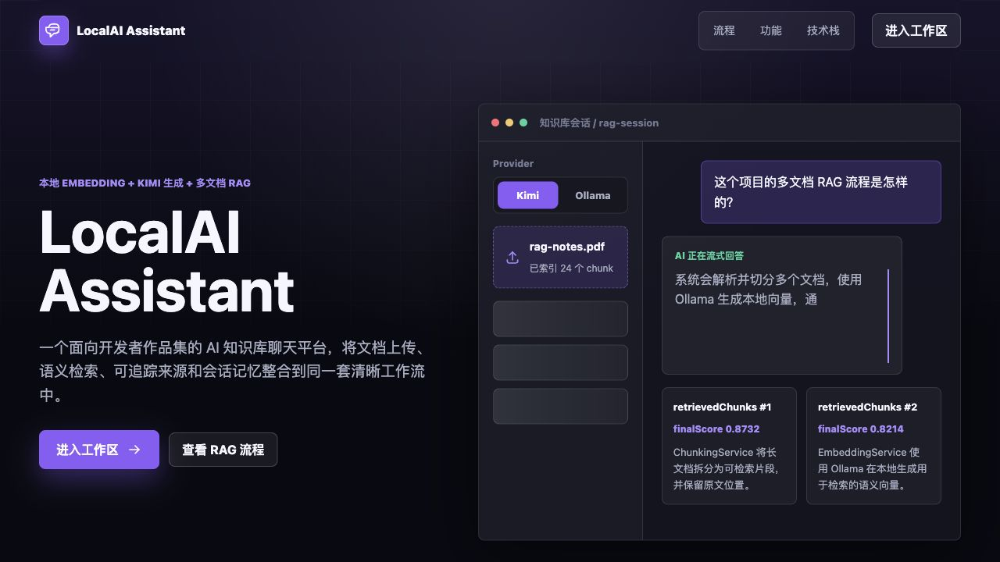
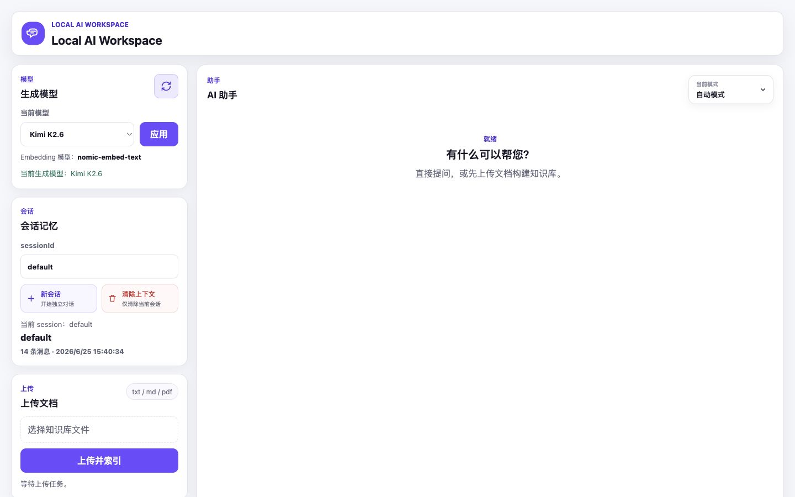
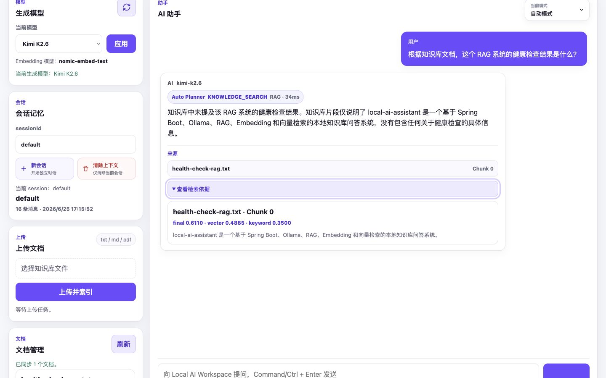
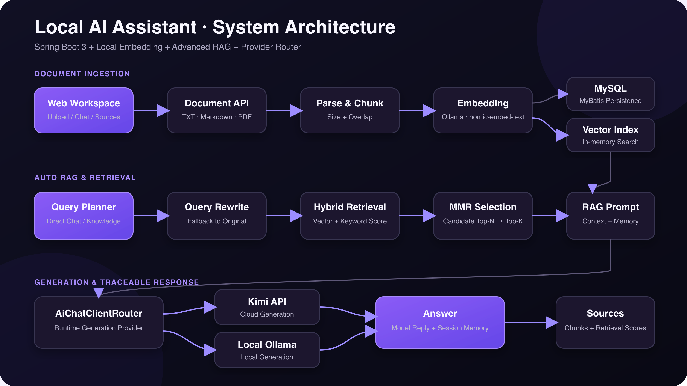
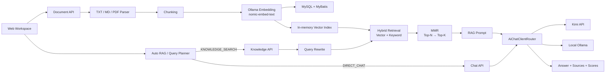

# 🚀 Local AI Assistant
Java 17 | Spring Boot 3 | RAG | Ollama | Kimi

> 基于 **Java 17 + Spring Boot 3** 的本地多文档 RAG 知识库问答系统，覆盖文档解析、Embedding、Hybrid Retrieval、MMR、Auto RAG 与多模型 Provider Router。

[](https://openjdk.org/projects/jdk/17/)
[](https://spring.io/projects/spring-boot)
[](https://maven.apache.org/)
[](https://www.mysql.com/)
[](https://ollama.com/)
[](#rag-pipeline)

这个项目面向本地知识库问答场景：上传 `TXT / Markdown / PDF` 文档后，系统自动完成解析、Chunk 切分、Embedding 与索引构建；提问时通过 Query Rewrite、混合检索和 MMR 选择上下文，再由 Kimi 或本地 Ollama 生成回答，并返回可追踪的来源片段与检索评分。

## 30 秒了解项目

| 方向 | 实现 |
| --- | --- |
| Java 后端 | Spring Boot REST API、参数校验、统一响应、异常处理、MyBatis 持久化 |
| RAG 链路 | Parse → Chunk → Embedding → Hybrid Retrieval → MMR → Prompt → Generation |
| 本地 AI | Ollama `nomic-embed-text` 负责 Embedding，内存向量索引负责检索 |
| 检索增强 | Query Rewrite、向量与关键词混合评分、MMR 多样性选择 |
| 智能路由 | Auto RAG / Query Planner 在 Direct Chat 与 Knowledge Search 间选择 |
| 模型扩展 | `AiChatClient` + `AiChatClientRouter` 支持 Kimi / Ollama Provider 切换 |
| 可解释性 | 返回来源 Chunk、`vectorScore`、`keywordScore`、`finalScore` |

## 项目截图

以下截图来自本地实际运行环境，演示数据不包含 API Key、数据库密码或个人文档内容。

| 页面 | 文件 | 说明 |
| --- | --- | --- |
| Landing Page | `docs/images/landing.png` | 项目定位与产品入口 |
| Chat-first Workspace | `docs/images/workspace.png` | 模型、会话、文档和聊天工作区 |
| RAG 问答与来源评分 | `docs/images/rag-demo.png` | Auto Planner、来源 Chunk 与检索评分 |
| 系统架构图 | `docs/images/architecture.png` | 文档入库、检索和生成链路 |

### Landing Page



### Chat-first Workspace



### RAG Demo



### Architecture



## 核心功能

- **多格式文档处理**：上传、解析和管理 `TXT / Markdown / PDF` 文档。
- **Chunk 与 Embedding**：按可配置的 `chunk-size`、`chunk-overlap` 切分文本，调用本地 Ollama `nomic-embed-text` 生成向量。
- **单文档 / 全局知识库问答**：支持限定文档检索，也支持跨全部已索引文档检索。
- **Advanced Retrieval**：使用 Query Rewrite 优化检索问题，结合向量相似度与关键词命中形成 Hybrid Score。
- **MMR 选择**：从候选 Top-N 中选择最终 Top-K，降低高度相似 Chunk 重复占用上下文。
- **Auto RAG**：Query Planner 将问题分类为 `DIRECT_CHAT` 或 `KNOWLEDGE_SEARCH`，前端复用现有接口完成路由。
- **Provider Router**：统一生成模型接口，支持 Kimi API 与本地 Ollama 运行时切换。
- **多轮会话记忆**：按 `sessionId` 隔离会话，并通过 MySQL 保存聊天历史。
- **检索结果可解释**：回答附带来源片段、文件名和分项检索评分。
- **Chat-first Workspace**：提供文档管理、会话管理、Provider 设置和 RAG 调试展示。

## 系统架构



### 设计边界

- Embedding 固定由本地 Ollama 提供，生成模型可在 Kimi 与 Ollama 之间切换。
- 文档、Chunk、Embedding JSON 和会话历史持久化到 MySQL。
- 应用启动时从 MySQL 重建内存向量索引，检索阶段暂未使用独立向量数据库。
- Auto 模式是轻量 Query Planner 与前端编排，不依赖 Agent 框架或额外中间件。

## 技术栈

| 层级 | 技术 |
| --- | --- |
| Language | Java 17 |
| Backend | Spring Boot 3.3.5、Spring Web、Bean Validation |
| Persistence | MySQL、MyBatis |
| Document Parsing | Apache PDFBox、自定义 TXT / Markdown Parser |
| Embedding | Ollama、`nomic-embed-text` |
| Retrieval | Cosine Similarity、Keyword Match、Hybrid Retrieval、MMR |
| Generation | Kimi API、本地 Ollama |
| Frontend | HTML、CSS、Vanilla JavaScript |
| Build & Test | Maven、JUnit 5、Node.js 脚本测试 |

## 快速启动

### 1. 环境要求

- JDK 17
- Maven 3.9+
- MySQL 8.x
- Ollama
- Node.js（仅运行前端脚本测试时需要）
- Kimi API Key（使用 `kimi` Provider 时需要；也可改用本地 Ollama）

### 2. 初始化 MySQL

```bash
mysql -uroot -p -e \
  "CREATE DATABASE IF NOT EXISTS local_ai_assistant DEFAULT CHARACTER SET utf8mb4 COLLATE utf8mb4_unicode_ci;"

mysql -uroot -p local_ai_assistant < sql/init.sql
```

### 3. 准备 Ollama 模型

```bash
ollama serve
ollama pull nomic-embed-text
```

如果生成模型也使用本地 Ollama：

```bash
ollama pull qwen2.5:0.5b
```

### 4. 配置本地环境变量

项目会读取仓库根目录的 `.env`。该文件已被 `.gitignore` 排除，请勿提交真实密钥。

```dotenv
MYSQL_PASSWORD=your_mysql_password
MOONSHOT_API_KEY=your_kimi_api_key
```

不使用 Kimi 时，可通过启动参数切换到 Ollama：

```bash
mvn spring-boot:run \
  -Dspring-boot.run.arguments="--ai.provider=ollama"
```

### 5. 启动应用

```bash
mvn spring-boot:run
```

访问：

- Landing Page：<http://localhost:8080/>
- Workspace：<http://localhost:8080/workspace.html>

### 6. 运行测试

```bash
mvn test
node src/test/js/workspace-auto-mode.test.cjs
```

## 项目结构

```text
local-ai-assistant/
├── docs/
│   └── images/                  # README 真实截图（待补充）
├── sql/
│   └── init.sql                 # MySQL 表结构
├── src/main/java/com/example/localai/
│   ├── client/                  # Kimi / Ollama Client 与 Provider Router
│   ├── config/                  # 数据源、模型和 RAG 配置
│   ├── controller/              # Chat、Document、Knowledge、Planner API
│   ├── dto/                     # 请求与响应对象
│   ├── exception/               # 业务异常和统一异常处理
│   ├── mapper/                  # MyBatis Mapper
│   ├── model/                   # 文档、Chunk、会话领域模型
│   └── service/                 # 解析、切分、Embedding、检索和问答流程
├── src/main/resources/
│   ├── mappers/                 # MyBatis XML
│   ├── static/                  # Landing Page 与 Chat-first Workspace
│   └── application.yml          # 默认配置
├── src/test/                    # Java 单元测试与前端脚本测试
└── pom.xml
```

## RAG Pipeline

### 文档入库

```text
Upload
  → File Validation
  → TXT / Markdown / PDF Parsing
  → Chunking with Overlap
  → Ollama nomic-embed-text
  → MySQL Persistence
  → In-memory Vector Index
```

### 检索与生成

```text
Question
  → Query Rewrite
  → Query Embedding
  → Vector Similarity + Keyword Match
  → Hybrid Score
  → MMR Candidate Selection
  → Top-K Context
  → Provider Router
  → Answer + retrievedChunks
```

关键步骤：

1. **Query Rewrite**：将口语化问题改写为更适合检索的短 Query；调用失败时回退原问题。
2. **Vector Retrieval**：计算 Query 与 Chunk Embedding 的 Cosine Similarity。
3. **Keyword Retrieval**：根据问题关键词对文件名和 Chunk 正文计算命中分数。
4. **Hybrid Retrieval**：按配置组合 `vectorScore` 与 `keywordScore`，得到 `finalScore`。
5. **MMR**：在相关性与内容多样性之间取舍，从候选 Top-N 中选出最终 Top-K。
6. **Prompt Construction**：拼接会话历史、来源文档与当前问题。
7. **Provider Router**：调用 Kimi 或本地 Ollama 生成回答。
8. **Traceable Response**：返回回答及 `retrievedChunks`，便于查看来源与检索评分。

默认检索配置：

```yaml
rag:
  rewrite:
    enabled: true
    max-length: 160
  hybrid:
    enabled: true
    vector-weight: 1.0
    keyword-weight: 0.35
  mmr:
    enabled: true
    lambda: 0.75
    candidate-size: 12
```

## Auto RAG 与 Provider Router

### Auto RAG

```text
User Question
  → POST /api/planner
  → DIRECT_CHAT       → POST /api/chat
  → KNOWLEDGE_SEARCH  → POST /api/knowledge/ask-global
```

Planner 先使用规则识别寒暄和知识库关键词；无法判断时可调用当前生成模型做轻量分类。模型调用失败或结果非法时，回退到配置的 `KNOWLEDGE_SEARCH`。

### Provider Router

```text
AiChatClient
├── KimiAiChatClient
└── OllamaAiChatClient

AiChatClientRouter
└── 根据 ai.provider 选择生成模型
```

该抽象只负责 Generation Provider。Embedding Provider 仍为本地 Ollama，避免模型切换影响已有向量索引。

## 主要 API

| Method | Endpoint | 说明 |
| --- | --- | --- |
| `POST` | `/api/documents/upload` | 上传并索引文档 |
| `GET` | `/api/documents` | 查看文档列表 |
| `GET` | `/api/documents/{documentId}` | 查看文档与 Chunk 摘要 |
| `DELETE` | `/api/documents/{documentId}` | 删除文档、数据库记录与内存索引 |
| `POST` | `/api/knowledge/ask` | 单文档 RAG 问答 |
| `POST` | `/api/knowledge/ask-global` | 多文档全局 RAG 问答 |
| `POST` | `/api/planner` | 判断 Direct Chat / Knowledge Search |
| `POST` | `/api/chat` | 普通多轮聊天 |
| `GET` | `/api/settings/provider` | 查看 Provider 状态 |
| `POST` | `/api/settings/provider` | 切换 Kimi / Ollama |

## Roadmap

| 版本 | 主要演进 | 状态 |
| --- | --- | --- |
| v1.0 | 文档上传、解析、Chunk、Embedding、基础向量检索 | 已完成 |
| v1.1 | 多文档全局问答与来源 Chunk 返回 | 已完成 |
| v1.2 | MySQL + MyBatis 持久化、会话记忆、启动索引重建 | 已完成 |
| v1.3 | Provider 管理、文档管理、会话管理、产品化控制台 | 已完成 |
| v1.4 | Query Rewrite、Hybrid Retrieval、MMR、可解释评分 | 已完成 |
| v1.5 | Chat-first Workspace、Sources 展示、统一问答体验 | 已完成 |
| v1.6 | Auto RAG、Query Planner、Direct Chat / Knowledge Search 路由 | 已完成 |

## 当前限制

- 当前使用内存向量索引，适合本地演示和中小规模文档实验，不代表生产级向量检索方案。
- MySQL 中保存 Embedding JSON，启动时需要重新加载到内存。
- 当前未实现用户体系、权限控制、限流和多租户隔离。
- 当前回答为非流式返回，尚未提供线上演示环境。
- RAG 效果主要通过功能测试验证，尚未建立系统化评测数据集。

## 后续计划

- 接入 pgvector、Milvus 或 Qdrant，对比独立向量数据库方案。
- 增加 SSE 流式回答和生成中断。
- 支持批量上传、重新索引、Metadata Filter 和更细粒度文档管理。
- 增加语义切分策略与可配置 Rerank 实现。
- 建立 RAG 评测集，评估召回质量、上下文相关性与回答忠实度。
- 增加 OpenAI-compatible Provider，并完善超时、重试与模型降级策略。
- 补充 Docker Compose、本地一键启动和 CI 检查。

## 安全说明

- API Key 和数据库密码通过环境变量或本地 `.env` 注入。
- `.env`、本地配置、运行日志、构建产物和上传文件均不应提交到 Git。
- 仓库仅提供环境变量名称与示例占位值，不包含真实凭据。
